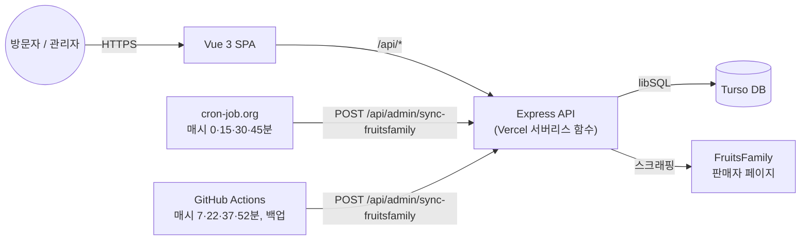

# Tokyo Collective

> 실제 중고 의류를 판매하는 1인 운영 쇼핑몰. [FruitsFamily](https://fruitsfamily.com) 판매자 페이지와 15분마다 자동 동기화해서 신규 상품 등록, 품절/재입고, 삭제, 가격 변경을 사람 손 없이 반영합니다.

🔗 **배포**: https://tokyo-collective.vercel.app
🔗 **저장소**: https://github.com/Sungju1204/tokyo-collective

## 스크린샷

<!-- TODO: 홈 화면 / 관리자 대시보드 스크린샷을 찍어서 아래에 추가하세요.
예)  -->

## 개요

| | |
|---|---|
| 기간 | 2026.08 ~ 운영 중 |
| 인원 | 개인 프로젝트 |
| 역할 | 기획, 설계, 프론트엔드, 백엔드, 배포, 운영 전부 담당 (AI 코딩 도구 Claude Code 활용) |

## 주요 기능

- **쇼핑몰**: 상품 목록, 카테고리 필터, 장바구니, 주문 기록. 결제 연동은 없고 구매 버튼은 FruitsFamily 원본 상품 링크로 연결됩니다.
- **관리자 대시보드**: 로그인 후 상품 등록·수정·삭제, 주문 확인, 재고 관리.
- **FruitsFamily 자동 동기화**: 15분마다 판매자 페이지를 읽어 신규 상품 등록, 품절/재입고 반영, 삭제된 상품 제거, 이름·가격 갱신을 자동 처리. (아래 "FruitsFamily 자동 동기화" 섹션 참고)

## 구조



## 설계 포인트 / 트러블슈팅

**멈추지 않는 자동 동기화**
동기화가 한 번이라도 빠지면 이미 팔린 옷이 사이트에 계속 남아 있게 됩니다. 그래서 실패 시 아무것도 바꾸지 않는 것을 기본으로 하고(부분적으로만 읽힌 데이터로 멀쩡한 상품이 삭제되지 않도록), 삭제처럼 되돌릴 수 없는 동작은 한 실행당 개수를 제한해 이상 상황에서 대량으로 잘못 반영되지 않게 했습니다.

**GitHub Actions 크론이 예약대로 돌지 않은 문제**
- **문제**: `*/15 * * * *`로 동기화 워크플로를 등록했는데, 5시간 넘게 예약 실행이 한 번도 실행되지 않았습니다. GitHub은 스케줄 실행 시각을 보장하지 않고, 다른 저장소들도 몰리는 정각대(0·15·30·45분)에는 지연되거나 아예 누락되는 경우가 있었습니다.
- **해결**: 실행 시각을 혼잡한 정각대에서 벗어난 분(7·22·37·52분)으로 옮기고, 외부 스케줄러(cron-job.org)를 주 경로로 추가해 이중화했습니다. GitHub Actions는 실패 알림이 오는 백업 경로로 남겨뒀습니다.

**Vercel 서버리스 환경에서 로그인이 무작위로 풀리던 문제**
- **문제**: 로그인 토큰을 서버 메모리에 저장했는데, Vercel이 요청을 여러 서버리스 인스턴스에 분산시켜서 한 인스턴스에서 로그인해도 다른 인스턴스는 그 토큰을 몰랐습니다. 그 결과 관리자가 무작위로 로그아웃됐습니다.
- **해결**: 서버 메모리에 상태를 두지 않고, 만료 시각을 포함해 HMAC으로 서명한 자체 검증 토큰으로 바꿨습니다. 인스턴스가 달라져도 같은 비밀키로 서명을 검증할 수 있어 문제가 해결됐습니다.

**상품 가져오기 기능의 SSRF 우회 가능성**
- **문제**: 후르츠패밀리 상품 URL을 허용된 호스트인지 검사했지만, `fetch`가 기본적으로 리다이렉트를 따라가서 허용된 호스트로 시작한 요청이 다른 곳(예: 내부 주소)으로 리다이렉트되면 검사를 우회할 수 있었습니다.
- **해결**: 리다이렉트를 자동으로 따라가지 않고 그 자체를 응답으로 받아, 허용되지 않은 목적지로 가는 리다이렉트는 실패로 처리하도록 고쳤습니다.

---

## 개발 문서

아래는 설치, 환경 변수, API 등 실제 개발/운영에 필요한 문서입니다.

## 기술 스택

- **프론트엔드**: Vue 3, Vue Router, Pinia, Vite
- **백엔드**: Node.js, Express
- **DB**: SQLite(로컬 개발) / [Turso](https://turso.tech)(운영, libSQL)
- **배포**: Vercel (서버리스 함수)
- **테스트**: Vitest
- **자동화**: GitHub Actions + [cron-job.org](https://cron-job.org) (15분마다 동기화 실행)

## 시작하기

### 1. 환경 변수 설정

프로젝트 루트에 `.env` 파일을 만드세요 (`.gitignore`에 포함되어 커밋되지 않습니다).

```bash
ADMIN_PASSWORD=관리자_로그인_비밀번호
SYNC_SECRET=$(node -e "console.log(require('crypto').randomBytes(32).toString('hex'))")
```

| 변수 | 필수 | 설명 |
|---|---|---|
| `ADMIN_PASSWORD` | 필수 | 관리자 로그인 비밀번호. 없으면 서버가 시작하지 않습니다. |
| `SYNC_SECRET` | 선택 | FruitsFamily 자동 동기화 엔드포인트를 보호하는 값. 없으면 해당 엔드포인트만 503을 응답합니다. |
| `TURSO_DATABASE_URL` / `TURSO_AUTH_TOKEN` | 선택 | 설정하면 Turso(운영 DB)를 쓰고, 없으면 로컬 SQLite 파일(`src/server/tokyo.db`)을 씁니다. |

### 2. 설치 및 실행

```bash
npm install

# 프론트엔드 (Vite dev server)
npm run dev

# 백엔드 (Express, 포트 3000)
node src/server/index.js
```

## 스크립트

| 명령 | 설명 |
|---|---|
| `npm run dev` | Vite 개발 서버 실행 |
| `npm run build` | 프로덕션 빌드 (`dist/`) |
| `npm run preview` | 빌드 결과 로컬 미리보기 |
| `npm test` | Vitest로 전체 테스트 실행 |

## 프로젝트 구조

```
src/
├── pages/           # 라우트별 화면 (홈, 장바구니, 결제, 관리자)
├── components/       # 공용 컴포넌트 (상품 목록, 헤더, 푸터 등)
├── stores/           # Pinia 스토어 (장바구니)
├── server/
│   ├── index.js           # Express 앱, 전체 API 라우트
│   ├── db.js               # DB 연결 및 스키마 초기화
│   ├── fruitsImport.js     # FruitsFamily 페이지 스크래핑/파싱
│   └── syncAvailability.js # 기존 상품의 품절·재입고·삭제·이름/가격 동기화 로직
api/
└── index.js         # Vercel 서버리스 함수 진입점 (src/server/index.js를 감쌈)
docs/superpowers/
├── specs/            # 기능 설계 문서
└── plans/            # 구현 계획 문서
.github/workflows/
└── sync-fruitsfamily.yml  # 동기화 백업 크론 (GitHub Actions)
```

## API 개요

전체 라우트는 `src/server/index.js`에 있습니다. 주요 그룹만 정리합니다.

| 그룹 | 라우트 | 인증 |
|---|---|---|
| 상품 | `GET /api/products`, `GET /api/products/:id` | 없음 |
| 상품 관리 | `POST /api/products`, `PATCH /api/products/:id`, `DELETE /api/products/:id`, `POST /api/admin/import-product` | 관리자 토큰 |
| 주문 | `POST /api/orders` (없음), `GET /api/orders`, `PATCH /api/orders/:id` (관리자) | 일부 |
| 재고 | `GET /api/inventory/:productId`, `GET /api/inventory/summary/alerts` | 없음 |
| 인증 | `POST /api/admin/login` | 없음 (비밀번호 검증) |
| 자동 동기화 | `POST /api/admin/sync-fruitsfamily` | `x-sync-secret` 헤더 |

관리자 인증은 세션 저장 없이 HMAC 서명된 토큰을 씁니다(서버리스 환경이라 인스턴스 간 메모리 공유가 안 되기 때문). `Authorization: Bearer <token>` 헤더로 전달합니다.

## FruitsFamily 자동 동기화

`POST /api/admin/sync-fruitsfamily`를 15분마다 호출하면 다음이 자동으로 일어납니다.

1. **신규 상품 등록**: 판매자 페이지에 새로 올라온 상품을 가져와 DB에 추가 (한 실행당 최대 20개)
2. **품절 / 재입고 반영**: 기존 상품의 FruitsFamily 페이지를 확인해 재고 상태를 맞춤 (한 실행당 최대 30개, 재고 있는 상품 우선)
3. **삭제 반영**: 상품 페이지가 사라졌고 판매자 목록에서도 빠졌을 때만 삭제 (한 실행당 최대 3개, 초과 시 전부 보류)
4. **이름 / 가격 동기화**: 유효한 값일 때만 갱신 (빈 이름, 0 이하 가격은 무시)

호출은 두 경로로 이중화되어 있습니다.

- **cron-job.org** (주 경로): 매시 0, 15, 30, 45분
- **GitHub Actions** (`sync-fruitsfamily.yml`, 백업): 매시 7, 22, 37, 52분

모든 동작은 실패 시 아무것도 바꾸지 않는 것을 기본으로 하고, 응답 JSON(`imported`, `soldOut`, `restocked`, `deleted`, `updated`, `*Skipped`)과 함수 로그에 무엇이 바뀌었는지 남깁니다. 설계 배경은 [`docs/superpowers/specs/2026-09-20-fruitsfamily-auto-sync-design.md`](docs/superpowers/specs/2026-09-20-fruitsfamily-auto-sync-design.md)에 있습니다.

## 배포

Vercel에 연결되어 있고 `master` 브랜치가 푸시되면 자동 배포됩니다. `vercel.json`이 `/api/*` 요청을 `api/index.js`(Express 앱 전체)로 넘기고, 나머지는 `dist/index.html`(SPA)로 넘깁니다.

Vercel 프로젝트에는 아래 환경 변수가 등록되어 있어야 합니다: `ADMIN_PASSWORD`, `SYNC_SECRET`, `TURSO_DATABASE_URL`, `TURSO_AUTH_TOKEN`.

## 테스트

```bash
npm test
```

`fruitsImport.js`와 `syncAvailability.js`의 로직을 네트워크·DB 없이 검증합니다(의존성을 주입받는 구조). 실제 DB나 FruitsFamily 응답과 맞는지는 로컬에서 수동으로 확인합니다.
